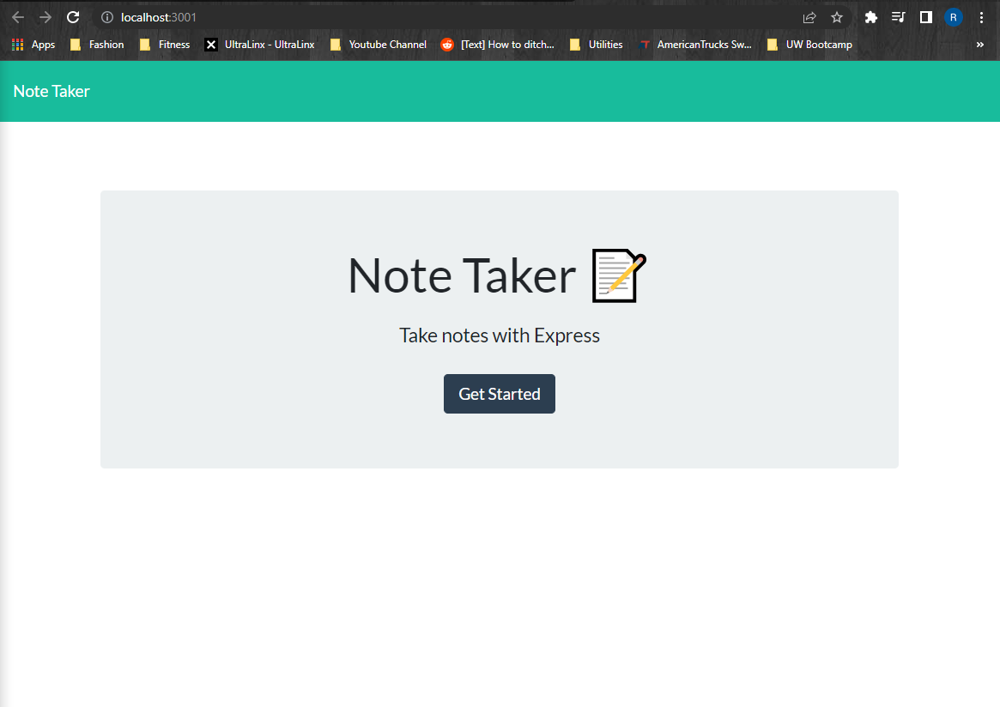
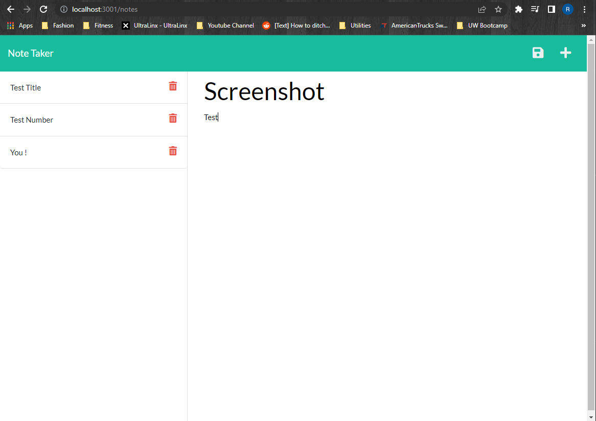

# 11 Express.js: Note Taker

 ## Table of Contents
  - [Description](#description)
  - [Installation](#nstallation)
  - [Screenshots](#screenshots)
  - [Links](#links)

## Description
This application is meant to take notes on a website and store them on the page and local storage. This is using a server, so the application has to be deployed to HEROKU because it needs that function. The main points of this excercise is to connect different assets in order to have the page deployed correctly. Usingf get and post methods in the sever.js files. Having them write onto the db.json and then write on the html page the user is using.

## Installation
This application uses express. Use npm i to initialize express.

## Screenshots
- 
- 

## Links
- GitHub : https://github.com/RafaelH731/note-taker
- Deployed Application :

